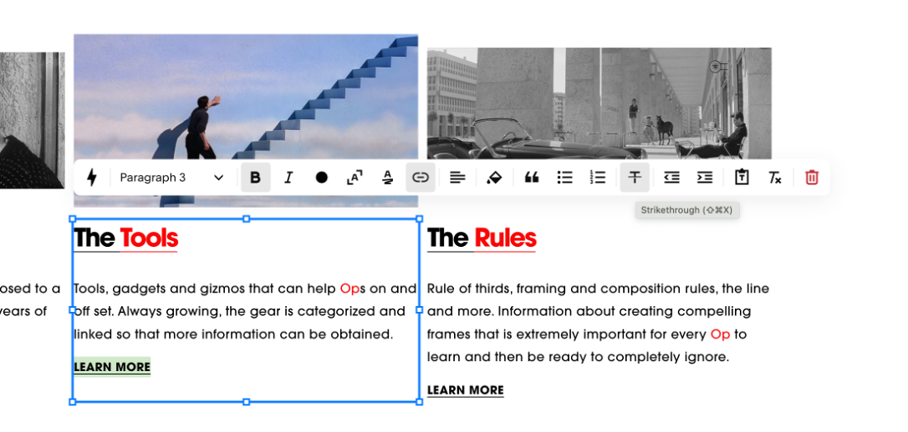

# theop-io-static

Static assets for https://theop.io

# Using our tweaks from Squarespace

## Simple tweaks

### Removing underlines from links

In the Squarespace editor, change the formatting of any link to _Strikethrough_ (Shift-Command-X) and our site tweak will get it to display without an underline:

_Engineering note_: This is effected through [site-tweaks CSS](src/site-tweaks/site-tweaks.scss) hacking `line-through`.

# Engineering notes

## Setup

- `npm install`

## Building

- `npm build`
- `npm serve` -> serves on port 5055
- `npm format:fix`

## Index of tweaks and features

- [Site tweaks](src/site-tweaks/README.md)
- [The Library](src/the-library/README.md)
- [The Words](src/the-words/README.md)
