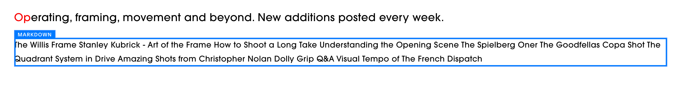
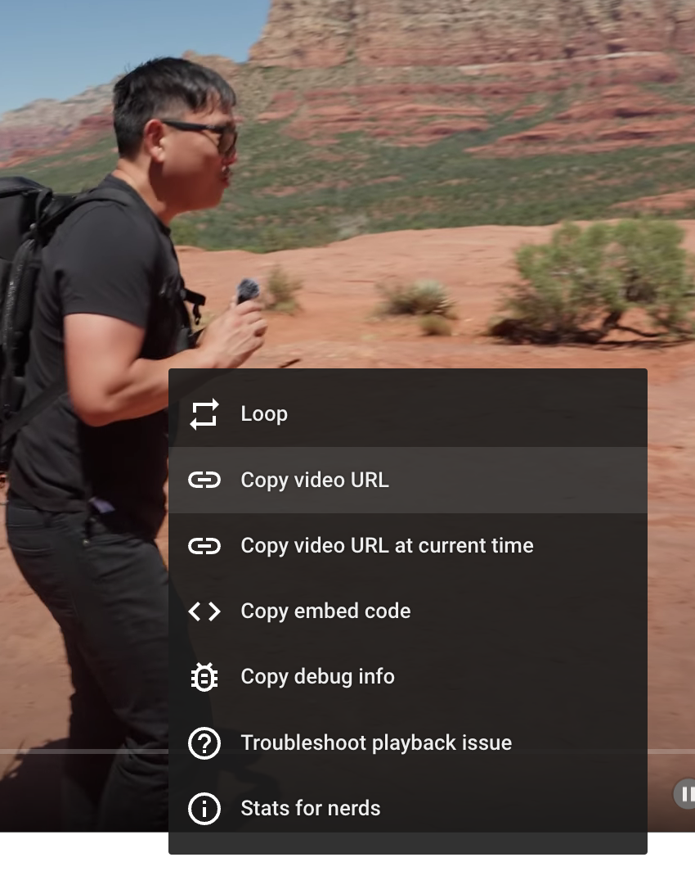

# The Library (video collection)

## How to use it

The source for videos needs to be specified in a list in a Markdown block in Squarespace:



Double-click that block to get into the Markdown editor:


Each video is represented as a Markdown-style link formed by the video title in square brackets, followed by a link to the video in parentheses, e.g.:

```
[How to Shoot a Long Take](https://youtu.be/a9xjsCpebfk)
```

You can most easily obtain the link to a video by right-clicking on it in YouTube and selecting _Copy video URL_, e.g.:



The code then interprets that list and generates the table of thumbnails, each linking to a popup/carousel spun to that video, with the surrounding videos also on offer.

**Note** that the code that interprets this list is somewhat persnickety about the format of the video links (it needs to auto-detect video IDs and such);
the _Copy video URL_ means of obtaining the link should be the safest option;
just copying the link that displays in the browser when you're watching the video may not work.

### Using this feature on other pages

This feature can work on any page on the site: just insert a new Markdown block and set it up with this basic skeleton:

```
<div class="video-library">

</div>
```

...and then put links in the middle.

## Engineering notes

See the [test page](index.html) and the [code behind](the-library.ts) for further details.

### Configuring the links

Enumerating the links from a `class`'d `<div>` in a Markdown block seemed to be the (relatively) easiest way of getting folks to list videos in Squarespace.

### Displaying the videos

Each video display consists of an image thumbnail and a fake play button (an inline SVG directive), swimming inside a larger set of floats for spacing/alignment.

The thumbnails are a bit special to obtain:

- For YouTube, we guesstimate a default path to a high-quality version of the thumbnail. We then attach a listener to the generated ``, monitor for any failures,
  and fix up failures by calling YouTube's `oembed` API to get a link to a workable thumbnail. Starting with the guesstimate is basically just a performance optimization.
- For Vimeo, we rely on the immensely convenient [vumbnail.com](https://vumbnail.com) to solve the problem for us.
