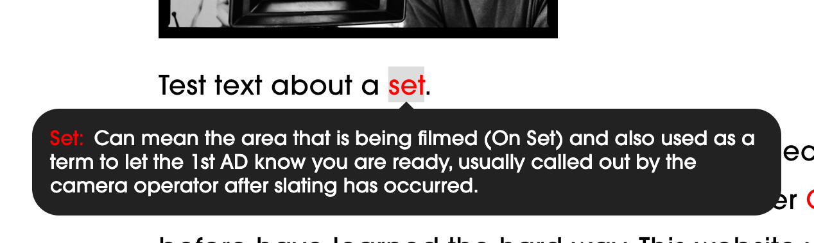

# Glossary ("The Words")

## How to use it

### Referencing words

To make a word eligible for tooltip highlighting, just wrap it in a link to `#thewords`:


Once applied (Apply, then Save and Exit the page), the wrapped word will appear in red and show its text on hover:



(_Engineering note_: Links starting with `#` are links to other anchors on the same page; we're abusing that feature to attach information to regular SquareSpace text that we can then look up.)

The above is an example of an _automatic_ lookup, which works if the text you're wrapping is the same word as the word you're looking up: just link it to `#thewords` and we'll look up the definition from the text directly.

It's not dependent on case, so linking the text "wedge" or "Wedge" to `#thewords` will look up `wedge`.
We also automatically ignore quotes and punctuation so you can link "wedge." and still look up `wedge`.

Many a time, though, you may want to **reference a different spelling or pluralization**, requiring an _explicit_ lookup.
In that case, wrap the word or phrase with a link to `#thewords_word_you_are_looking_up`.

For example, wrap "up- or down-stage" with a link to `#thewords_upstage`:


Once applied (Apply, then Save and Exit the page), the wrapped phrase will appear in red and show its text on hover:


**Note** that for explicit lookups, you need to provide a "programmatic" version of the word: it must be entirely lower-case and spaces must have been replaced with underscores (e.g. `#thewords_camera_wedge` instead of `#thewords_Camera wedges`).

Additional features:

- Since some of our words have multiple keys (e.g. "flop/floppy"), they get automatically broken into "flop" and "floppy" (but are also available as "flop/floppy").

### Maintaining the word list

[the-words-list.txt](the-words-list.txt) contains the list of words for our site-wide glossary.

Each term needs to follow the format of `Word - Definition`, e.g.:

```
Solid - A piece of solid duvatene that light cannot pass through in a frame used to block out light from a scene or take care of lens flare.
```

The "key" for a word (e.g. `Solid` above) may also contain one or more slashes (`/`), in which case the combined term as well as the words between slashes can be referenced.

For example:

```
Flop/Floppy - A 4x4 solid that has...
```

is available for lookup as `flop`, `floppy`, and `flop/floppy`.

Lines may also start with a `;`, serving as comments. Feel free to use these to (e.g.) delineate different sections of the file.

Lines may also be empty to create some breathing room.

### Including the word index on the main index page

Provide the following HTML code block:

```
<div class="clearfix">
  <!-- Search bar -->
  <form id="the_words_search_form">
    <input id="the_words_search_input" type="search" placeholder="Search..." />
  </form>
</div>
<div id="the_words_index">
  <!-- Word index gets injected here -->
  Loading...
</div>
```

## Engineering notes

Check out [this test page](https://theop-io-static.netlify.app/the-words/) and [the code behind it](index.html).

### iPhone compatibility

[A few tricks](https://dev.webonomic.nl/fixing-the-iphone-css-hover-problem-on-ios) will work to make iPhones respond to touch events;
we'll use option #3 (tabIndex="0") in our test code here.
SquareSpace pulls this or one of the other tricks so it works there as well. Woot.
